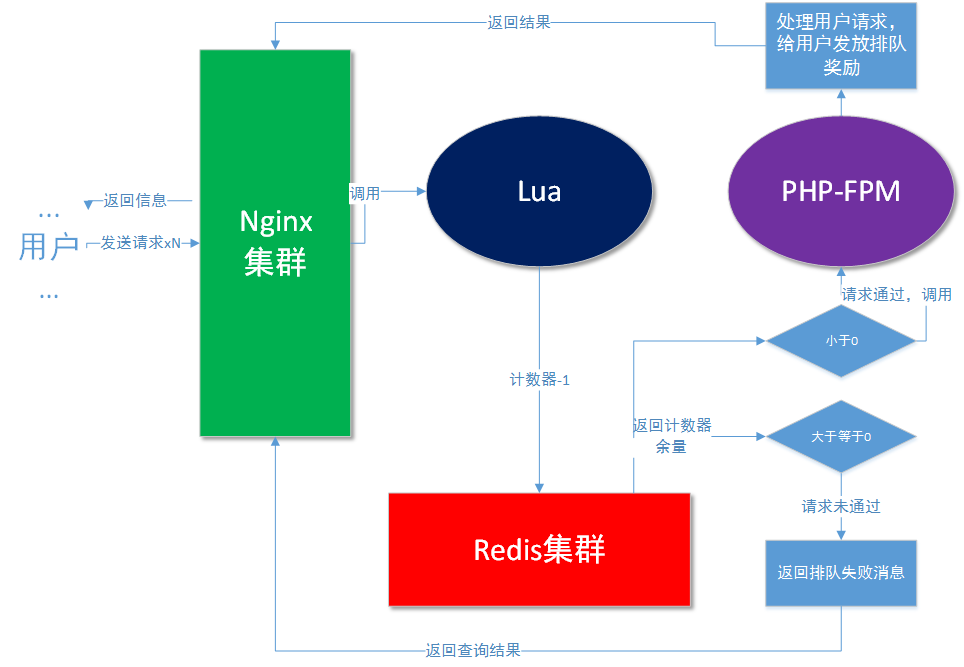

ngx_lua_php_queue
=================

nginx+lua+php+redis实现单业务排队系统架构

在做并发量很大的秒杀活动时，php会因为并发量过大而php进程不足导致服务器负载过大，无法同时处理过多请求，返回不友好的502错误。该项目旨在将php进程的压力转移到nginx层，使用lua作为中间语言，redis读取/储存队列信息，大大提高了并发量，降低了php进程的负载压力。

LICENSE:
https://github.com/takatost/ngx_lua_php_queue/blob/master/LICENSE

安装
------------

1. 首先安装[openresty](http://openresty.org/cn/index.html)和[php](http://www.php.net)、[redis](http://www.redis.io)
2. 安装完成后，将`lua_script`和`php_scripts`放入web文档目录，默认为`/opt/htdocs/lua_queue`
3. 接着讲nginx/conf中的配置文件放入openresty的nginx配置文件目录，如`/opt/ngx_openresty_1.7.2.1/nginx/conf`
4. 打开配置文件`conf/vhosts/lua_queue.com.conf`。
<blockquote>第2行：redis服务器的配置，`server 地址:端口;`</blockquote>
<blockquote>第8行：web域名配置，`server_name 域名;`</blockquote>
<blockquote>第9行：web和php文档目录配置，`root 文档目录;`，默认为`root /opt/htdocs/lua_queue/php_scripts;`</blockquote>
<blockquote>第9行：web和php文档目录配置，`root 文档目录;`</blockquote>
<blockquote>第27行：lua文档目录配置，`root lua文档目录;`，默认为`access_by_lua_file /opt/htdocs/lua_queue/lua_scripts/content.lua;`</blockquote>
5. 配置完成后，重启nginx，载入配置文件
6. 将域名的hosts写入/etc/hosts
7. 配置php的redis设置
<blockquote>
打开`php_scripts`文档目录下的config.php，将redis地址和端口填入其中
</blockquote>
8. 建立cron任务，`*/1 * * * * php /opt/htdocs/lua_queue/php_scripts/cron_queue.php`，一分钟执行一次，更新redis计数器
9. 到此，安装步骤全部完成，打开配置的域名首页来看看吧

原理
------------

相关文档
------------
1. http://openresty.org/cn/index.html
2. http://wiki.nginx.org/HttpRedis2Module
